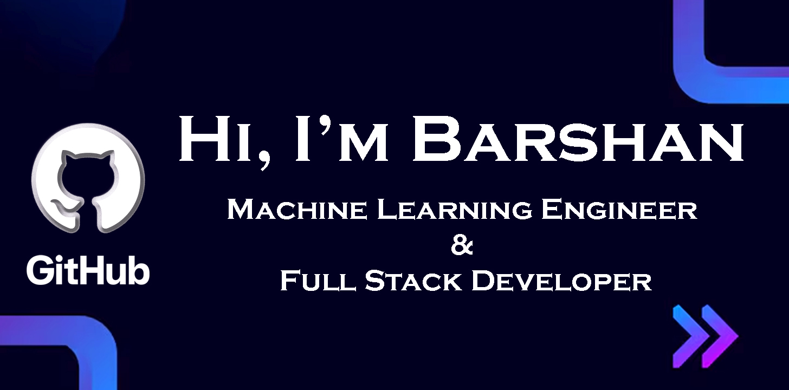
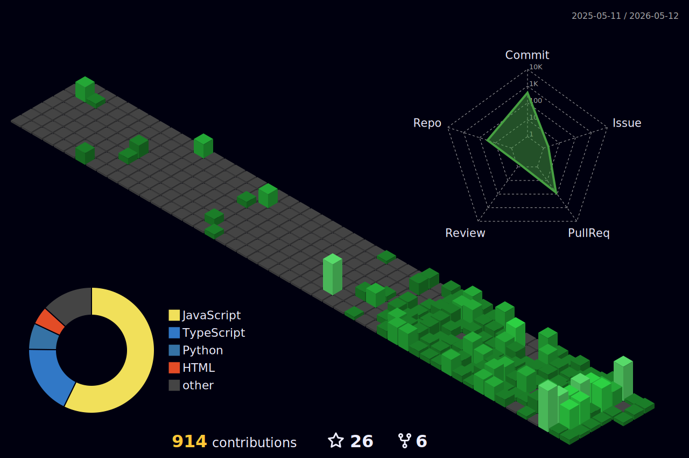

<div align="center">
  
</div>

<div align="center">
  <a href="https://git.io/typing-svg">
    
  </a>
</div>

<div align="center">
  
</div>

<br/>

<div align="center">
  
</div>

<br/>

<h2 align="left">
  
  &nbsp;<b>About Me</b>
</h2>

```yaml
🚀 Welcome to my profile!
user: Barshan Majumdar
role: 
  - AI & Machine Learning Researcher
  - Machine Learning Engineer
  - Full Stack Developer

education:
  degree: "B.Tech in Computer Science & Engineering (AI)"
  university: "Brainware University, Barasat"

research_interests:
  - "AI, ML & Deep Learning"
  - "Image Processing & Computer Vision"
  - "Smart Antennas"
  - "Real-time AI at the Edge"

current_focus:
  - "Developing real-time AI solutions"
  - "Working on an AI Resume Checker"
  - "Building high-performance edge AI systems"
  - "Growing as an open-source contributor"

achievements:
  - "4th position at HackStorm 2.26:
  - "Winners @Signifiya 26"
  - "Contributor at GirlScript Summer of Code (GSSoC) 2025"
  - "Researcher in AI-driven Edge Systems"
  - "Campus Ambassador at Elenxia"
  - "Student Ambassador at LetsUpgrade"

goals:
  - "Crack GATE (CSE)"
  - "Secure M.Tech admission in a top IIT"
  - "Become a successful developer with strong industry impact"
  - "Publish impactful AI research papers"
  - "Launch innovative AI-powered products"

projects:
  - "AI Resume Checker (JS + TS)"
  - "CodeChatter – A LeetCode x Facebook hybrid"
  - "ResumeHub - Create ATS friendly resume with multiple templates"
  - "StudyQ - Smart student and teacher management system"
  - "LearnSphere - An fully AI driven learning platform"
  - "Kisan Mitra - A AIML based platform which can help farmers to their crop predictions, daily tasks and progress tracking"
  - "Learn Flow - A comprehensive local-first ed-tech platform designed to democratize access to personalized education"
  - "GeetaGPT - A modern, spiritual AI companion that offers guidance and wisdom inspired by the Bhagavad Geeta."
  - "Avaya" - A safety-first navigation system that prioritizes secure travel over the shortest distance.
  - "ShieldX - A secure exam cheating detector, along with the eco of your posture, voice and full controls your device with lockdown window."

hobbies: 
  - "Photoshoots 📸"
  - "Bike Riding 🏍️"
  - "Cars & Automotive Tech 🏎️"
  - "AI Video Creation & Content Making"
  - "Reading Books"
```

<div align="center">
  <a href="https://in.linkedin.com/in/barshan-majumdar" target="_blank">
    
  </a>
  <a href="mailto:connect.barshan.majumdar@gmail.com" target="_blank">
    
  </a>
  <a href="https://portfolio-barshan.vercel.app/" target="_blank">
    
  </a>
</div>

<br/>

<h2 align="left">
  
  &nbsp;<b>Academic Performance (SGPA)</b>
</h2>

### Average SGPA (1st, 2nd and 3rd Semesters): **9.67**

| Semester | SGPA |
| :---: | :---: |
| **1st** | 10.00 |
| **2nd** | 9.40 |
| **3rd** | 9.61 |


<br/>

<h2 align="left">
  
  &nbsp;<b>My Technology Stack</b>
</h2>


<h3 align="left">
  
  &nbsp;<b>1. Known Languages</b>
</h3>

<p align="center">
  
  
  
  
  
  
  
</p>

<h3 align="left">
  
  &nbsp;<b>2. Tools, Libraries & Frameworks</b>
</h3>

<p align="center">
  
  
  
  
  
  
  
  
  
  
  
  
  
</p>

<h3 align="left">
  
  &nbsp;<b>3. Deployment & Hosting</b>
</h3>

<p align="center">
  
  
  
</p>

<br/>

<h2 align="left">
  
  &nbsp;<b>Coding Activity</b>
</h2>

<div align="center">
  
</div>

<br/>

<h2 align="left">
  
  &nbsp;<b>Statistics</b>
</h2>

<!-- <div align="center">
  
</div> -->

<br/>


[](https://github.com/vn7n24fzkq/github-profile-summary-cards) [](https://github.com/vn7n24fzkq/github-profile-summary-cards)
[](https://github.com/vn7n24fzkq/github-profile-summary-cards) [](https://github.com/vn7n24fzkq/github-profile-summary-cards)

<h2 align="left">
  
  &nbsp;<b>Featured Projects</b>
</h2>

| Project | Description | Stack | Repo Links | Live |
| :--- | :--- | :--- | :--- | :--- |
| **LearnSphere** | A totally AI driven online learning platform | `React` `Node` | [Repo](https://github.com/Barshan-Majumdar/LearnSphere.git) | Coming Soon... |
| **ResumeHub** | All in one platform to design ATS friendly resume  | `TypeScript` `CSS` | [Repo](https://github.com/Barshan-Majumdar/ResumeHub.git) | [ResumeHub](https://resume-hub-barshan-ttm.vercel.app/) |
| **StudyQ** | A student and teacher management system for study metarials | `JavaScript` `TypeScript` | [Repo](https://github.com/Barshan-Majumdar/StudyQ.git) | [StudyQ](https://study-q.vercel.app/) |
| **CodeChatter** | A mixed platform that includes social and practical practices for students & coders | `TypeScript` | [Repo](https://github.com/Barshan-Majumdar/Project_CodeChatter.git) | Coming Soon... |
| **Resume Checker** | A tool uses keywords to match your resume with job description | `Python` `CSS`  `TypeScript` | [Repo](https://github.com/Barshan-Majumdar/AI-Resume-Checker.git) | Coming Soon... |
| **Kisan Mitra** | A AIML based platform which can help farmers to their crop predictions, daily tasks and also their progress tracking | `HTML` `CSS` `JavaScript` `TypeScript` | [Repo](https://github.com/Barshan-Majumdar/Kisan-Mitra.git) | [Kisan Mitra](https://kisan-mitra-gamma.vercel.app/login) |
| **Learn Flow** | A comprehensive local-first ed-tech platform designed to democratize access to personalized education | `HTML` `CSS` `JavaScript` `TypeScript` | [Repo](https://github.com/Barshan-Majumdar/Learn-Flow.git) | [Learn Flow](https://learn-flow-mu.vercel.app/) |
| **GeetaGPT** | GeetaGPT is a modern, spiritual AI companion that offers guidance and wisdom inspired by the Bhagavad Geeta. Users can converse with an AI persona of Lord Krishna to find solace, clarity, and answers to life's dilemmas. | `HTML` `CSS` `TypeScript` | [Repo](https://github.com/Barshan-Majumdar/GeetaGpt.git) | [GeetaGPT](https://geeta-gpt-inky.vercel.app/) |
| **Avaya** | A safety-first navigation system that prioritizes secure travel over the shortest distance. | `React` `Tailwind` `TypeScript` `PostgreSQL` `Leaflet` `NeonDB` | [Repo](https://github.com/Barshan-Majumdar/avaya.git) | [Avaya](https://avaya-main.vercel.app/) |
| **ShieldX** | A secure exam cheating detector, along with the eco of your posture, voice and full controls your device with lockdown window. | `React` `Tailwind` `TypeScript` `FastAPI` `OpenCV` `YOLO` `Python` | [Repo](https://github.com/Barshan-Majumdar/ShieldX.git) | Coming Soon... |

<br/>

<h2 align="left">
  
  &nbsp;<b>Contribution History</b>
</h2>

<div align="center">
  <picture>
    <source media="(prefers-color-scheme: dark)" srcset="https://raw.githubusercontent.com/Barshan-Majumdar/Barshan-Majumdar/output/github-contribution-grid-snake.svg">
    <source media="(prefers-color-scheme: light)" srcset="https://raw.githubusercontent.com/Barshan-Majumdar/Barshan-Majumdar/output/github-contribution-grid-snake.svg">
    
  </picture>
</div>

<br/>

<h2>
  
  <b>Connect With Me</b>
</h2>

<div align="center">
  <a href="mailto:connect.barshan.majumdar@gmail.com">
    
  </a>
  <a href="https://in.linkedin.com/in/barshan-majumdar">
    
  </a>
  <a href="https://portfolio-barshan.vercel.app/">
    
  </a>
</div>

<br />
<br />

<div align="center">
  
  
  <br />
  
  <h2><b>Thank you for exploring my journey!</b></h2>
  
  <br />

  <p align="center">
    <i>"Dream is not that which you see while sleeping, it is something that does not let you sleep."</i>
    <br />
    <b>— Dr. APJ Abdul Kalam</b>
  </p>

  <br />

  
</div>
